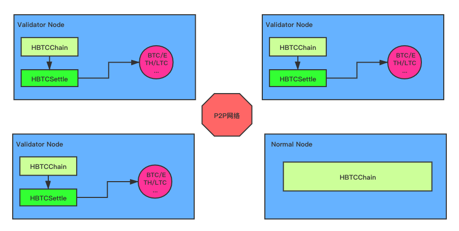

# HBTC Chain Introduction

Bluehelix is the next generation decentralized custody and clearing technology. Based on decentralization and community consensus, it employs comprehensive technologies including cryptography and blockchain, supports decentralized governance through technology, and aims to effectively solve the security and trust problems faced by centralized digital assets platforms. HBTC Chain is the public blockchain on decentralized custody and settlement of digital assets based on Bluehelix technology.

# Innovations

Blockchain technology has invented whole new assets and currencies, as well as trustless transactions, which opens a new era of economics growth and enables unlimited depth for global trading. It empowers the virtual world created by the internet and brings brand new business opportunities. However, limited by performance and cross-chain problems, complicated requirements are yet implemented on blockchain. These problems are more demanding as the digital assets on blockchain keep growing fast. To solve them, HBTC Chain brings the following three innovative advantages.

- **Decentralized & Secure Cross-chain Custody **： Decentralized key management is the core technology of Bluehelix. The private keys are managed through the collaboration and consensus of all validators; not a single party can manipulate the custodian digital assets.

- **Fast & Scalable Consensus Clearing**：HBTC Chain incorporates innovative consensus mechnism named BHPOS, which combines BFT and DPOS to establish an open and high-performing public blockchain platform. HBTC Chain also employs horizontal sharding to implement scalable transaction clearing.

- **Comprehensive API Support**：As an open source public blockchain, HBTC Chain provides public API for all categories of dinancial and business services. Insitutions and startups which use our API, are able to focus on creating and operating financial products and business applications, without concerning low-level infrastructure with security and trust.

# Technical Principles

The decentralized key management is the core technology of Bluehelix . Combining various cryptography tools including ECDSA, commitment, zero-knowledge proof, and multi-party computation, we implement the distributed private key generation and signature for cross-chain assets among all validators. On top of that we build light-weight and non-intrusive cross-chain asset custody. On the clearing layer, HBTC Chain employes BHPOS consensus and horizontal sharding mechanisms to achieve high-performaing transaction clearing.

# Overall Architecture

HBTC Chain utilizes BHPOS consensus, with the guarantee of security and efficiency, the nodes can be distinguished into validator nodes and ordinary nodes, and the validator nodes need to process cross-chain related data, store private key shares and sign transactions, the specific architecture diagram is as below：

The structure is described as follows：

- **HBTC Chain**：HBTC Chain main service, responsible for transaction consensus and block generation/storage, etc.

- **HBTC Settle**：HBTC Chain Settlement Service, responsible for processing cross-chain transactions and private key share generation, decentralized signatures, cross-chain transactions verification & interaction etc.

# Three-layered Nodes

For balancing the safety and efficency (the decentralized key signature will be less efficentive along with the  the expension of private key keeping nodes) , and expend the community consensus, HBTC Chain proposes the three-layered node model to solve these issues: 

- **Ordernary nodes**：can have any ordinary node, which will participate in  transaction sending, and RPC services,  blocks synchronization, any user can dock with

- **Consensus node **：there will be about 35 consensus nodes at early stage which will participate in  transaction sending, and RPC services,  blocks packing and consensus block generating, users can join in by pleding enought HBC

- ** Core nodes**：Core nodes are participating transaction sending 
